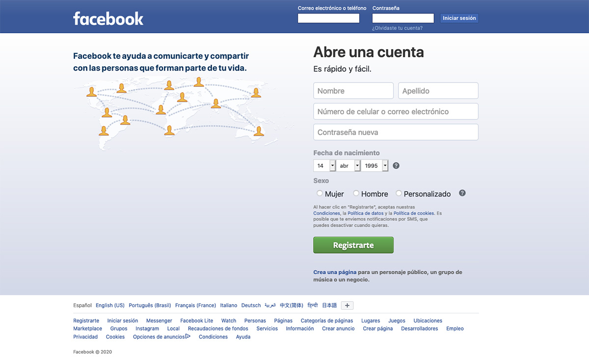
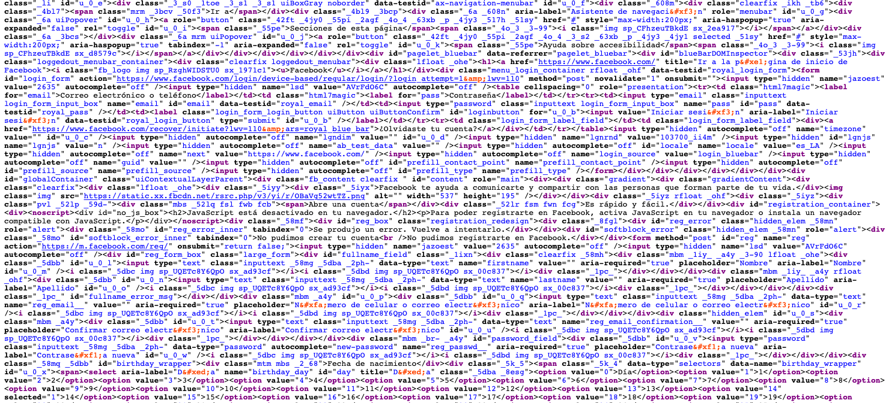
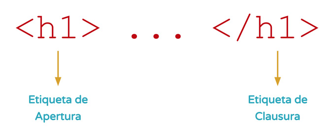
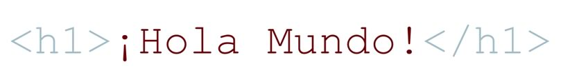
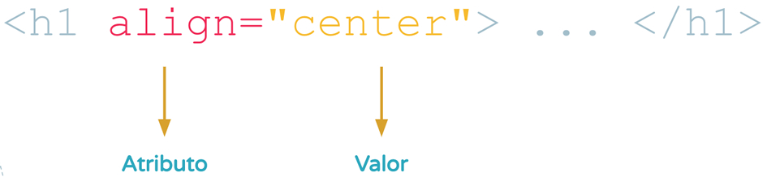
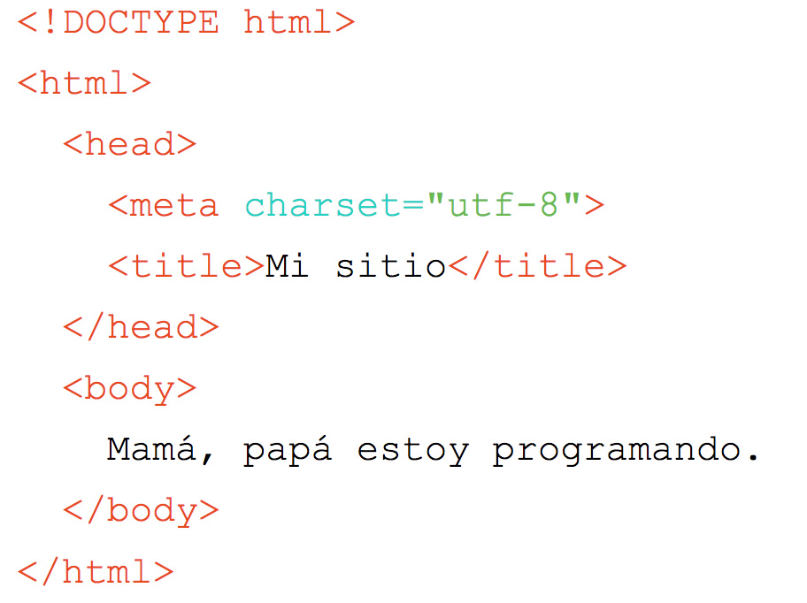
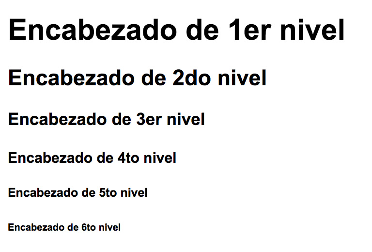
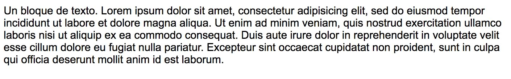
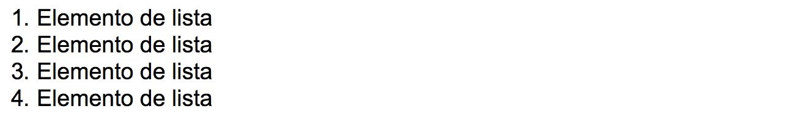
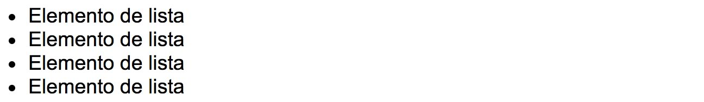

# Capítulo I - Introducción a HTML
<a name="top"></a>

### Tabla de contenido

+ [Qué es HTML](#html)
+ [Concepto de Etiqueta](#etiquetas)
+ [Concepto de Elemento](#elemento)
+ [Concepto de atributo](#atributo)
+ [Estructura básica de un documento HTML](#estructura)
+ [Etiquetas](#etiquetas)
	+ [Encabezados](#headers)
	+ [Párrafos](#p)
	+ [Listas ordenadas](#ol)
	+ [Listas desordenadas](#ul)
+ [Rutas](#rutas)
	+ [Relativas](#relativas)
	+ [Absolutas](#absolutas)
+ [Enlaces](#anchors)
	+ [Externos](#externos)
	+ [Locales](#locales)
	+ [Internos](#internos)
+ [Imágenes](#imagenes)
+ [Ejercicio Integrador](#integrador)
+ [*Volver al índice principal*](https://github.com/japsolo/curso-intro-html-css/) 

---

<a name="html"></a>
### Qué es HTML

Lo primero que necesitamos saber es que HTML **no es un lenguaje de programación**. Lo que quizás nos deja con una enorme duda de: **Y entonces ¿qué es HTML?**. Bien, para responder a esta pregunta, podemos decir que HTML es un lenguaje de marcado de hipertexto (en inglés _Hyper Text Markup Language_).

Básicamente, HTML este lenguaje que está compuesto de **etiquetas**, las cuales a su vez conforman **elementos** y poseen **contenido y atributos**.

_Wooow_ ¡Vamos más lento por favor!. Antes de pasar a estos conceptos "técnicos". Entendamos un poco de donde viene este lenguaje.

Es importante que sepamos que la primer versión de HTML fue publicada en 1991 por [Tim Berners-Lee](https://es.wikipedia.org/wiki/Tim_Berners-Lee), un científico británico. En principio esta versión contenía muy pocas etiquetas.

Sobre Tim, debemos saber también que es conocido como el padre de la web, fundador de la W3C - [World Wide Web Consortium](http://w3c.org), creador del protocolo **HTTP** (_HyperText Transfer Protocol_), creador de la **URL** (_Uniform Resource Locator_) y creador del primer navegador web. ¿Sorprendente no? Por eso **amamos** a Tim.

Ahora bien, pasando un poco más a lo técnico. HTML es un lenguaje que es interpretado por el navegador para mostrar los sitios web tal y como estamos acostumbrados. En la siguiente imagen podemos ver un sitio web como generalmente estamos habituados.



Pero _"tras bambalinas"_ lo que realmente está sucediendo es esto:


_Vos por tu cuenta podés ver este código también en cualquier sitio web, basta con que pulsés el click derecho del mouse y elijás la opción **ver codigo fuente**_

Como te das cuenta, lo visual, está compuesto por código HTML, por etiquetas (elementos), contenido y atributos. En algunas palabras podríamos decir que el HTML es el ADN de cualquier sitio web.

Más claro ahora ¿no?. Ahora si, con esta pequeña introducción, estamos listos para adentrarnos en los conceptos más técnicos y entender **¿qué son las etiquetas?**.

[ volver a la tabla de contenido](#top)

---

<a name="etiquetas"></a>
### Concepto de etiqueta

Una vez habiendo entendido de primera mano qué es HTML, ahora podemos adentrarnos en uno de sus conceptos más clave: **las etiquetas**.

Podríamos decir que una etiqueta, es un bloque de código que representa algo de manera visual. Por ejemplo, si quisieramos generar un título principal en nuestro archivo HTML. Tendríamos que usar la etiqueta para títulos principales, mientras que si queremos mostrar una imagen, tendremos que usar la etiqueta para invocar imágenes.

Cómo podemos darnos cuenta, **cada etiqueta cumple con una función particular**. Cada etiqueta es responsable de algo específico.

Lógicamente, como en cualquier lenguaje, existe una manera correcta de escribir las cosas, HTML no es la excepción, pues tiene en si, una forma correcta de escribir las etiquetas, a esto lo llamamos **sintaxis**. Veamos de manera gráfica como es la **sintaxis** de una etiqueta HTML.



Como podemos ver, **una etiqueta está compuesta por dos partes**, _la etiqueta de apertura_ y la _etiqueta de clausura_. Las cuales tienen algo en particular y es el uso de los símbolos `<` y `>`. Así mismo las dos partes, dentro de los símbolos `<` y `>` llevan el nombre de la etiqueta que deseamos usar. Adicionalmente la _etiqueta de clausura_ lleva el símbolo `/` antes del nombre de la etiqueta. Un ejemplo de varias etiquetas sería:

```html
<h1>Título principal</h1>
<h2>Título secundario</h2>
<p>Un párrafo o bloque de texto.</p>
```

¿Sencillo verdad? Cómo te das cuenta no es tan complicado como parece. Ahora que ya entendemos que es una etiqueta. Podemos seguir avanzando y aprender qué es un **elemento de HTML**.

[ volver a la tabla de contenido](#top)

---

<a name="elemento"></a>
### Concepto de elemento

El concepto de elemento es el más sencillo de todos. Pues basta con ver la siguiente imagen para entenderlo en su totalidad.



Cómo podemos ver, **un elemento** no es otra cosa más que **una etiqueta y su contenido interno**. Obviamente, las etiquetas podrían tener a su vez **atributos**, pero ese es un concepto que ahondaremos más adelante.

[ volver a la tabla de contenido](#top)

---

<a name="atributo"></a>
### Concepto de atributo

Bastante bien hasta el momento ¿no? Como nos damos cuenta, paso a paso vamos construyendo los conceptos clave para comprender en contexto todo el lenguaje HTML.

Ahora, veamos algo sencillo, el concepto de **atributo**. Basicamente podemos definir que un atributo, es: _"la parte de una etiqueta que nos permite modificar o asignar alguna característica en particular"_. Veamos un ejemplo:



Como lo podemos ver en la imagen anterior, un **atributo**, como primera medida **siempre se escribe dentro de la etiqueta de apertura** y generalmente **está compuesto de 2 partes**.

La primer parte, es el atributo en si, el cual va acompañado del signo `=` y la segunda parte es el valor, la cual va siempre dentro de `""`.

En la imagen se ve el atributo `align` cuyo valor es `center`. Pensemos un momento en ¿qué está haciendo este atributo? ¿Se te ocurre algo?. Fácil ¿no?, tal como quizá lo está pensando. Dicho atributo da una alineación al texto que esté dentro del elemento `h1`, en este caso particular, está alineando su contenido al centro.

Atributos hay muchos. E incluso, se pueden usar varios a la vez dentro de un mismo elemento. Veamos unos sencillos ejemplos:

```html
<a href="http://www.google.com" title="Vamos a Google"> Ir a Google </a>

```

Como ves, muchas veces, un atributo _"habla por si sólo"_. Pues, si bien no hemos visto los elementos mencionados en el ejemplo de arriba, quizá puedas intuir qué hace cada uno de ellos.

[ volver a la tabla de contenido](#top)

---

<a name="estructura"></a>
### Estructura básica de un documento HTML

Ya que hemos avanzado bastante, podemos ahora adentrarnos más en un concepto  bastante clave: **la estructura básica** de cualquier archivo HTML. ¿Qué significa esto? Literalmente, la **estructura que siempre debe estar presente en cualquier documento HTML**.

Veamos la siguiente imagen:



Como podemos darnos cuenta, la estructura básica, está compuesta de varios elementos de HTML, cada uno presente con una responsabilidad en particular, veamos para qué es cada uno de ellos:

+ `<DOCTYPE html>` : este elemento sirve para definir qué versión del lenguaje estamos usando. En este caso, definimos que usamos la versión `HTML5`.
+ `<html> </html>` : este elemento contiene a todos los demás elementos del documento. Sirve para especificar que todo su contenido interno debe ser interpretado como lenguaje HTML.
+ `<head> </head>` : este elemento contiene la información inherente al documento. Sirve para especificar entre otras cosas, la codificación de caracteres y el título de documento.
+ `<meta charset="utf-8">` : este elemento define la codificación de caracteres que deseamos usar. En este caso, una codificación que incluye cualquier caracter extraño para el navegador, como las vocales con acentos, las ñ's, las ç y cualquier caracter de "tipo" especial. La omisión de este elemento y su atributo `charset` puede generar que los caracteres mencionados se vean mal.
+ `<title> </title>` : este elemento contiene un texto que será el título del documento HTML. Este texto será visible en la pestaña del navegador.
+ `<body> </body>` : este elemento contiene a **todos** los demás elementos _"visuales"_ (textos, imágenes, videos, etc) que deseemos mostrar al usuario.

[ volver a la tabla de contenido](#top)

---

<a name="etiquetas"></a>
### Etiquetas

Veamos ahora un par de etiquetas/elementos que nos serviran para generar distintos tipos de contenido de texto.

<br>

<a name="headers"></a>
#### Encabezados

Los encabezados o titulares, nos sirven para generar distintos tipos de títulos/subtítulos. Las etiquetas de encabezados son 6:

```html
<h1>Encabezado de 1er nivel</h1>
<h2>Encabezado de 2do nivel</h2>
<h3>Encabezado de 3er nivel</h3>
<h4>Encabezado de 4to nivel</h4>
<h5>Encabezado de 5to nivel</h5>
<h6>Encabezado de 6to nivel</h6>
```
El código anterior, al momento de ser implementado dentro del `<body>` de nuestro documento HTML se verá así:



Como ves. Cada `<h_>` genera un elemento que visualmente se ve distinto. Pues cambia el tamaño de la tipografía según el elemento que deseemos usar. Cabe aclarar que **estos elementos los podemos usar en el orden que deseemos** dentro de nuestro documento HTML. No tienen que ir en este orden estricto.

[ volver a la tabla de contenido](#top)

<br>

<a name="p"></a>
#### Párrafos

Los párrafos son unos de los elementos más comunes, junto con los encabezados, que usamos con mucha regularidad. Los mismos se generar así:

```html
<p>Un bloque de texto. Lorem ipsum dolor sit amet, consectetur adipisicing elit, sed do eiusmod tempor incididunt ut labore et dolore magna aliqua. Ut enim ad minim veniam, quis nostrud exercitation ullamco laboris nisi ut aliquip ex ea commodo consequat. Duis aute irure dolor in reprehenderit in voluptate velit esse cillum dolore eu fugiat nulla pariatur. Excepteur sint occaecat cupidatat non proident, sunt in culpa qui officia deserunt mollit anim id est laborum.</p>
```

El código anterior, al momento de ser implementado dentro del `<body>` de nuestro documento HTML se verá así:



Cómo es lógico y al igual que con los [encabezados](#headers), podemos usar cuantas veces necesitemos, la etiqueta `<p>`, pues como vimos anteriormente, la misma nos permite generar bloques de texto a _piacere_.

[ volver a la tabla de contenido](#top)

<br>

<a name="ol"></a>
#### Listas ordenadas

La lista ordenada, es la etiqueta que nos permite generar, tal como su nombre lo indica, un listado de cosas que serán rotuladas por una viñeta/bullet la cual tendrá un aumento progresivo.

Generalmente la lista ordenada (y también la desordenada) usa dos tipos de etiqueta, la etiqueta de lista, para este caso `<ol>` y la etiqueta de _elemento de lista_ `<li>`. Veamos el código:

```html
<ol>
	<li>Elemento de lista</li>
	<li>Elemento de lista</li>
	<li>Elemento de lista</li>
	<li>Elemento de lista</li>
</ol>
```

El código anterior, en nuestro navegador se vería así:



Como vemos, este tipo de lista ya tiene implementado un tipo de viñeta/bullet, en este caso numérico. El cual es auto incremental, pues a medida que vamos insertando elementos `<li>` la viñeta/bullet va aumentando.

**A tener en cuenta**: `<ol>` significa _Ordered List_ y `<li>` _List Item_.

[ volver a la tabla de contenido](#top)

<br>

<a name="ul"></a>
#### Listas desordenadas

La lista desordenada, no dista mucho de la [lista ordenada](#ol), pues básicamente tiene la misma estructura, lo único que cambia es el tipo de etiqueta que contiene a los elementos de lista `<li>`. Veamos el código:

```html
<ul>
	<li>Elemento de lista</li>
	<li>Elemento de lista</li>
	<li>Elemento de lista</li>
	<li>Elemento de lista</li>
</ul>
```

El código anterior, en el navegador se vería así:



Al igual que en la [lista ordenada](#ol), en la lista desordenada se va generando una viñeta/bullet. Sin embargo aquí no es auto incremental, por lo general será un `•`.

**A tener en cuenta**: `<ul>` significa _Unordered List_.

[ volver a la tabla de contenido](#top)

---

<a name="rutas"></a>
### Rutas

Las rutas, dentro de un documento de HTML, nos sirven para **especificar donde se encuentra un determinado recurso**. Por ejemplo, si quisieramos invocar una imagen dentro del documento HTML, tendríamos que usar la etiqueta de imagen (``) e indicarle a la misma la **ruta de ubicación** en donde puede hayar el archivo de imagen que queremos se vea en el navegador.

Sin embargo, la imagen, no es el único elemento de HTML que usa las **rutas**. Existen otros elementos más que también usan rutas para buscar recursos específicos. Esos elementos los veremos más adelante.

Ahora bien, al hablar de rutas (también conocidas como **path's**) nos encontramos con 2 tipos. Las [rutas relativas](#relativas) y la [rutas absolutas](#absolutas). Veamos como funciona cada una de ellas.

<br>

<a name="relativas"></a>
#### Rutas relativas

Las **rutas relativas** están relacionadas con la ubicación actual en la que se encuentra un documento HTML. Si tuvieramos la siguiente arquitectura de archivos en nuestra computadora:

```
.
├── index.html          #archivo HTML
├── images              #folder de imágenes
│   ├── gatito.jpg      #archivo JPG
│   └── perrito.png     #archivo PNG
└── ...
```

Entendiendo que todos estos archivos se encuentran dentro de un mismo folder. Si quisieramos poder acceder desde el `index.html` al archivo `perrito.png` tendríamos que implementar (en la etiqueta `img`) la **ruta relativa**:

```
images/perrito.png
```

¿Así de sencillo?. Rotundo SI. Pues al estar estos archivos dentro de un mismo folder _"padre"_, solamente necesitamos especificar desde ese punto de partida, el camino que `index.html` tiene que recorrer para llegar a `perrito.jpg`. Muy fácil ¿no te parece?.

**A tener en cuenta**: en HTML **nunca** utilizaremos rutas que hagan referencia al disco duro de nuestra computadora, algo tipo `C:/Mis Documentos/Mi Folder/mi_archivo.ext` no funciona bien.

[ volver a la tabla de contenido](#top)

<br>

<a name="absolutas"></a>
#### Rutas absolutas

Las **rutas absolutas** a diferencia de las relativas, necesitan toda la información en donde está ubicado un recurso. Por generalidad y construcción del lenguaje HTML. Las únicas **rutas absolutas** permitidas son las que comienzan con `http://`, es decir, aquellas que _"viven"_ en un servidor web.

Veamos algunos ejemplos:

```
https://www.youtube.com/results?search_query=michael&jackson
```

La anterior **ruta absoluta** al ser implementada en una etiqueta de enlace, nos llevaría al sitio web de youtube, a la sección de resultados de busqueda del artista Michael Jackson.

Si por otro lado, tuviésemos la siguiente ruta:

```
https://es.wikipedia.org/wiki/Michael_Jackson#/media/File:Michael_Jackson_in_1988.jpg
```

La misma, al ser implementada en una etiqueta de imagen, nos mostraría el archivo `Michael_Jackson_in_1988.jpg` que _"vive"_ o se _"aloja"_ en los servidores de [wikipedia](https://es.wikipedia.org/).

[ volver a la tabla de contenido](#top)

---

<a name="anchors"></a>
### Enlaces

Muy bien, hasta el momento hemos entendido qué son las **rutas** y qué tipos existen. Y de cierta manera pudimos entender donde las podemos usar.

Así que llegó el momento de introducir otra etiqueta de HTML, el `<a></a>`, la cual nos sirve para hacer enlaces o vínculos. Se llama **a** porque en inglés es llamada *anchor* .

Pero ¿para qué sirven los enlaces?. Los enlaces, nos sirven, tal como su nombre lo indica, para enlazar, conectar, vincular, distintos archivos HTML entre si. Incluso también para ir a un sitio web distinto al nuestro e inclusive para ver archivos de tipo imagen, pdf, .zip, etc. Y como la algunos de los conceptos que hasta el momento hemos visto. Los enlaces existen en distintos tipos.

<br>

<a name="externos"></a>
#### Enlaces externos

Los **enlaces externos** son aquellos que nos permiten visitar un documento html ajeno a nuestro propio sistema de archivos. Ejemplo: si quisieramos un enlace que desde nuestro HTML nos lleve a Facebook o Twitter, a eso se le denomina un enlace externo. Ahora bien ¿cómo lo podemos generar?. De la siguiente manera:

```html
<a href="http://www.twitter.com" target="_blank">Sígueme en Twitter</a>
<a href="http://www.facebook.com" target="_blank">Visita mi Fanpage</a>
```

Como vemos en el anterior ejemplo, la etiqueta `<a>` lleva dos atributos. Uno es el `href` en el cual se especifica la [ruta](#rutas) (en este caso una [ruta absoluta](#absolutas)) a donde queremos que el usuario se dirigido al hacer clic. Y el otro es el `target` el cual define en qué pestaña de nuestro navegador se va a abrir ese recurso. `_blank` significa abrir el recurso en una pestaña nueva.

<br>

<a name="locales"></a>
#### Enlaces locales

Ahora bien, los **enlaces locales** son aquellos que nos permiten visitar un documento HTML o un recurso propio de nuestros sistema de archivos. Por ejemplo, si quisieramos ir desde el `index.html` al `quienes-somos.html`, usaremos un enlace local. Veamos un ejemplo:

```html
<a href="index.html">Volver al HOME</a>
<a href="quienes-somos.html">Acerca de NOSOTROS</a>
```

En el ejemplo anterior, solo necesitamos especificar la [ruta](#rutas) (en este caso [ruta relativa](#relativas)) del recurso que deseamos enlazar. Y aquí, no es necesario el atributo `target`, pues de no especificarlo, el recurso se abrirá en la pestaña actual de nuestro navegador.

<br>

<a name="internos"></a>
#### Enlaces internos

Los **enlaces internos** a diferencia de los dos anteriores, nos sirven para poder recorrer distintos lugares dentro de un mismo documento HTML. El ejemplo más claro de este tipo de enlaces es [Wikipedia](http://es.wikipedia.org/). Podríamos decir que este tipo de enlace, funciona como una especie de *ascensor*, que nos lleva para arriba o para abajo, según corresponda. Pensemos que estamos en la sección *MENU / CARTA* de un restaurante y que tenemos varias opciones:

```html
<a href="#entradas">Entradas</a>
<a href="#platos-fuertes">Platos Fuertes</a>
<a href="#para-compartir">Para compartir</a>
<a href="#bebidas">Bebidas</a>
<a href="#postres">Postres</a>
```

Como lo vemos, en el atributo `href` todos los valores comienza con el símbolo `#`. Lo cual indica que ese *"lugar"* se encuentra dentro de ese mismo documento HTML en el cual nos encontramos. Sin embargo para que esto funcione perfectamente, necesitaremos crear un punto de referencia dentro del documento para que al dar clic sobre el enlace, el mismo sepa exactamente a donde queremos ir. Estos puntos de referencia se generan con el atributo `id`.

```html
<a href="#entradas">Entradas</a>
<a href="#platos-fuertes">Platos Fuertes</a>

<h2 id="entradas">Entradas</h2>
<p>Descripción y contenido de este apartado de información</p>

<h2 id="platos-fuertes">Platos Fuertes</h2>
<p>Descripción y contenido de este apartado de información</p>
```

Es importante remarcar que el atributo `id` puede ser aplicado en cualquier etiqueta y a su vez debemos entender que el valor que definamos dentro del mismo **NO** se puede repetir, pues de hacerlo, tendriamos dos puntos de referencia con mismo nombre y el enlace no sabría a cual de los dos ir.

[ volver a la tabla de contenido](#top)

---

<a name="imagenes"></a>
### Imágenes

Las imágenes, son uno de los recursos más utilizados al momento de elaborar documentos HTML, pues las mismas le dan "vida" a nuestros proyectos y hacen de los mismos algo, visualmente más amigable.

Para trabajar con imágenes, vamos a usar la etiqueta ``, la cual es una etiqueta con *auto closing* que basicamente significa que se cierra a si misma, es decir, **NO** vamos a necesitar algo tipo `</img>`, es más, eso no existe.

Otra cosa que debemos tener en cuenta, es que las imágenes son invocadas, pero ¿qué significa esto?. Basicamente que siempre que implementemos una imagen en un documento HTML, necesitamos su referencia exacta en nuestra estructura de archivos. En otras palabras, vamos a necesitar que esas imágenes que deseemos implementar *"vivan"* dentro del mismo folder en donde tenemos nuestros archivos HTML. Algo así:

```
.
├── index.html                #archivo HTML
├── quienes-somos.html        #archivo HTML
├── contacto.html             #archivo HTML
├── images                    #folder de imágenes
│   ├── nosotros.jpg          #archivo de imagen
│   ├── banner-01.jpg         #archivo de imagen
│   └── icono-contacto.png    #archivo de imagen
└── ...
```

Por lo tanto si quisieramos implementar alguna de estas imágenes en cualquiera de nuestros documentos HTML haríamos lo siguiente:

```html


```

Como vemos en el ejemplo anterior, la etiqueta `` está usando dos atributos: `src` y `alt`. El primero (`src`: source u origen), podemos deducir que hace referencia a la ubicación en donde se encuentra el archivo de imagen. Esta bueno aclarar que esta [ruta](#rutas) puede ser [relativa](#relativas) o [ absoluta](#absolutas). Y el segundo (`alt`: texto alternativo) se utiliza para describir de manera breve pero explicita a qué hace referencia la imagen. El valor asignado en este atributo es **obligatorio** y se mostrará en dado caso que la imagen no haya podido cargarse.

[ volver a la tabla de contenido](#top)


<!-- Mini proyecto: hacer una página simple y subirla a Bitballoon -->

<!-- [subir](#top) -->

---

**Made with ❤️ by: [Javi Herrera](https://javier-herrera.com)**

*Si te parece interesante este tipo de contenido, puedes agradecerme con un Follow en mis siguientes redes sociales. Lo estimaría un montón.*

[](https://www.linkedin.com/in/japsolo/)
[](https://www.instagram.com/thefullstackdevs/)
[](https://open.spotify.com/show/3J2dLuBSfzt9VVnEF8q18a)