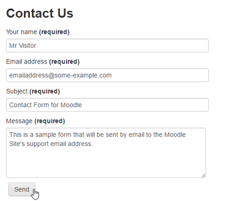

# Capítulo II - Etiquetas contenedoras y Formularios de HTML
<a name="top"></a>

### Tabla de contenido

+ [Etiquetas contenedoras](#tags-contenedoras)
	+ [div](#div)
	+ [header](#header)
	+ [nav](#nav)
	+ [footer](#footer)
	+ [section](#section)
	+ [article](#article)
+ [Formularios en HTML](#forms)
	+ [form](#form-tag)
	+ [label](#label)
	+ [input](#input)
		+ [text](#type-text)
		+ [password](#type-pass)
		+ [tel](#type-tel)
		+ [email](#type-email)
		+ [radio](#type-radio)
		+ [checkbox](#type-check)
		+ [file](#type-file)
	+ [textarea](#textarea)
	+ [select + option](#select)
	+ [button](#button)
	+ [Atributos](#attrs)
		+ [name](#name)
		+ [value](#value)
		+ [checked](#checked)
		+ [selected](#selected)
		+ [required](#required)
		+ [placeholder](#placeholder)
+ [*Volver al índice principal*](https://github.com/japsolo/curso-intro-html-css/) 

---

<a name="tags-contenedoras"></a>
### Etiquetas contenedoras

Las etiquetas contenedoras nos sirven para poder insertar cualquier tipo de contenido dentro de ellas, generalmente se les conoce como *"containers"*, pues con ellas podremos comenzar a diagramar mejor el esquema visual de nuestro sitio web. Para lograr una diagramación como la siguiente:


Existen varias etiquetas *"container"* y cada una de ellas tiene una finalidad en particular, sin embargo todas se paracente entre si por un aspecto en particular y es que **NO POSEEN** ninguna característica visual. Adicionalmente vale la pena aclarar que éstas etiquetas, se pueden usar cuantas veces querramos en nuestros documentos HTML.

Así que, veámos cada una de ellas:

<br>

<a name="div"></a>
### DIV

El `<div></div>`, literalmente traduce **división** y es un tag muy usado, pues siempre que querramos hacer un contenedor de información lo podremos usar. Su implementación sería así:

```html
<div class="products-container"></div>
```

Como vemos en el ejemplo anterior. El `<div>` es una etiqueta que como la mayoría tiene, tag de apertura y de cierre. Pues dentro de la misma, podremos insertar cualquier tipo de contenido que deseemos, como títulos, imágenes, párrafos, enlaces, etc.

Algo particular que vemos en el ejemplo es el atributo `class=""`. A esta altura te estarás preguntado ¿Y para qué sirve esto?. Pues bien, el atributo `class=""` nos sirve para poder aplicar una regla de estilo de **CSS** la cual le dará un estilo visual (ancho, alto, fondo, etc), claro que este es un concepto el cual ahondaremos clases más adelante.

[ volver a la tabla de contenido](#top)

<br>

<a name="header"></a>
### HEADER

El `<header>` representa una *cabecera* de página. Puede contener cualquier tipo de información relevante que pensemos deba estar presente en la cabecera de nuestro documento, como por ejemplo el logo de la compañia, la barra de navegación del sitio, un formulario de búsqueda y cosas por el estilo. Su implementación sería algo así:

```html
<header class="main-header"></header>
```

Así como pasa con el `<div>`. El `<header>` es un elemento que para poder tomar un estilo visual, necesita de **CSS**. Tal como ves, **CSS** va tomando un protagonismo muy importante al momento que pensamos hacer un sitio web.

[ volver a la tabla de contenido](#top)

<br>

<a name="nav"></a>
### NAV

El `<nav>` nos sirve para definir la barra de navegación de nuestro sitio web. La misma define un arbol de vinculos a los cuales podemos acceder, los cuales serán representados por una lista, elementos de lista y enlaces así:

```html
<nav class="main-navbar">
  <ul>
    <li><a href="index.html">Inicio</a></li>
    <li><a href="nosotros.html">Nosotros</a></li>
    <li><a href="productos.html">Productos</a></li>
    <li><a href="contacto.html">Contacto</a></li>
  </ul>
</nav>
```

Al igual que los otros tags que ya hemos visto, el `<nav>` para poder tomar un estilo visual, necesita de **CSS**. 

[ volver a la tabla de contenido](#top)

<br>

<a name="footer"></a>
### FOOTER

El `<footer>`, tal como lo indica su nombre es el *pié de página*. Dentro de este tag, va toda la información que querramos mostrar al final de nuestro documento HTML. Su implementación, al igual que los otros tags, es bastante sencilla:

```html
<footer class="main-footer"></footer>
```

Dentro del `<footer>` incluso podríamos tener una segunda barra de navegación `<nav>` que le permita a nuestros usuarios visitantes acceder a las secciones más comunes de nuestro sitio web.

[ volver a la tabla de contenido](#top)

<br>

<a name="section"></a>
### SECTION

El `<section>` es un elemento que se asemeja mucho al `<div>` pues nos ayuda a hacer una división o sección de contenido dentro de un documento HTML. La idea del `<section>` es darle un valor jerárquico a cada una de estas secciones de contenido.

Dentro de un `<section>` pueden ir cualquier tipo de elementos (titulares, párrafos, imágenes, listas, div's, etc). Su implementación también es sencilla.

```html
<section class="last-news"></section>
```

Siempre que pensemos en hacer una sección de contenido dentro de un documento HTML, podremos pensar en usar un `<section>`.

[ volver a la tabla de contenido](#top)

<br>

<a name="article"></a>
### ARTICLE

El `<article>` es un elemento que sirve para generar, porciones de contenido dentro de una sección. Es decir si tuvieras un `<section class="last-news">` que contiene las noticias más recientes. Vas a querer que cada noticia tenga su propio *container*, es aquí donde podrás implementar al `<article>. Veamos un ejemplo:

```html
<section class="last-news">
   <article class="news-content"></article>
   <article class="news-content"></article>
   <article class="news-content"></article>
</section>
```

En el ejemplo anterior el `<section>` es el *container* de los `<article>` y cada `<article>` es a su vez el *container* de la información de cada noticia (titular, imagen, enlace, etc). Realmente sencillo ¿no es así?

[ volver a la tabla de contenido](#top)

---

<a name="forms"></a>
## Formularios en HTML

Los formularios en HTML, son quizá uno de los elementos más importantes de HTML, pues nos permiten capturar información del cliente/usuario para que luego podamos guardar la misma en alguna base de datos o para hacer algo tan sencillo como un formulario de contacto que le permita al visitante de nuestro sitio web ponerse en contacto con nosotros. Un formulario básico puede verse así:



Como podemos ver, un formulario de HTML está compuesto de varios elementos, los cuales obviamente son generados por medio de etiquetas HTML. Así que bien ¿le damos para adelante? veamos éstas etiquetas.

<br>

<a name="form-tag"></a>
## FORM

La etiqueta `<form>` es súper importante, pues la misma nos permite definir algunas cosas básicas pero necesarias si queremos procesar la información recibida en el formulario. La misma se implementa así:

```html
<form action="" method=""></form>
```

Como lo ves. Esta etiqueta posee dos atributos `action` y `method`. Cada uno con un objetivo particular. `action` sirve para definir la ruta en donde se procesará la información capturada en el formulario. Mientras que `method` define como se envía la informacion, aquí hay solo dos valores posibles `get` y `post`.

Cabe decir también que **TODOS** los campos que querramos implementar en el formulario, irán dentro dentro de esta etiqueta.

[ volver a la tabla de contenido](#top)

<br>

<a name="label"></a>
## LABEL

El tag `<label>` nos sirve para implementar un texto que acompañe a cada campo del formulario. Este texto describe lo que esperamos que el usuario haga dentro del campo. Ejemplo *Ingresá tu nombre* ó *Escribí tu correo electrónico*. Veamos:

```html
<label>Ingresá tu nombre</label>
```

Como ves, el `<label>` es un texto importante, pues ayuda a describir de manera clara la información que esperamos recibir en un determinado campo.

[ volver a la tabla de contenido](#top)

<br>

<a name="input"></a>
## INPUT

El tag `<input>` es un tag multifunción. Pero ¿qué significa esto?. Básicamente qué con la misma etiqueta, podemos generar distintos tipos de campos de formulario. Su implementación es de la siguiente manera:

```html
<input type="">
```

Como ves, el `<input>` posee un atributo (que no es el único) súper importante, el `type=""`. Éste mismo recibe un valor y dependiendo de ese valor se generará un distinto tipo de campo. Veamos sus posibles valores:

+ <a name="type-text"></a>`text`: un input de tipo *text* (`<input type="text">`) genera un campo básico de una sola línea que recibe cualquier tipo de caracteres (letras / números). Es el más utilizado, pues si queremos pedirle al visitante de nuestro sitio web su nombre, apellido, domicilio, usaremos este tipo de campo.
+ <a name="type-pass"></a>`password`: un input de tipo *password* (`<input type="password">`) genera un campo de una sola línea, pero esta vez, cualquier cosa que escribamos dentro de él la veremos asi: **••••••**.
+ <a name="type-email"></a>`email`: un input de tipo **email** es lo mismo que un input de tipo **text** con una pequeña particularidad. Y es que el mismo nos pide que lo que ingresemos en él, coincida con un formato de email válido (usuario@servidor.com).
+ <a name="type-tel"></a>`tel`: un input de tipo **tel** es similar al input de tipo **text**, con la particularidad de que si estamos en un dispositivo móvil, el teclado que nos muestra el dispositivo, será el teclado numérico.
+ <a name="type-radio"></a>`radio`: un input de tipo **radio** cambia drásticamente respecto a los anteriores, pues éste ya no permite que el usuario ingrese texto, si no que genera un *botón de opción* que el usuario deberá clicar. Se usa con frecuencia para campos en donde de todas las opciones dadas, solo es posible elegir una de ellas.
+ <a name="type-check"></a>`checkbox`: tal como el anterior, un input de tipo **checkbox** no permite inserción de contenido de texto. Genera una *casilla de verificación*. Se usa para campos en donde queremos que de las opciones dadas, sea posible elegir varias de ellas.
+ <a name="type-file"></a>`file`: un input de tipo **file** también cambia de manera rotunda, pues genera un botón de **explorar** el cual abrira el explorador de archivos del sistema y permitirá elegir cualquier archivo del mismo.

En código, estos `<input>` se verían así:

```html
<input type="text">
<input type="password">
<input type="email">
<input type="tel">
<input type="radio">
<input type="checkbox">
<input type="file">
```

[ volver a la tabla de contenido](#top)

<br>

<a name="textarea"></a>
## TEXTAREA

El tag `<textarea>` nos permite generar el tradicional campo de comentarios. Este campo es multilínea y también es bastante utilizado, pues más allá de la información que deseamos solicitar, siempre está bueno dejar un campo para que cualquier persona que use nuestro sitio web nos pueda dejar un mensaje cualquiera. Éste campo se genera así:

```html
<textarea></textarea>
```

[ volver a la tabla de contenido](#top)

<br>

<a name="select"></a>
## SELECT + OPTION

Quizás hayas visto en algunos formulario de contacto aquellas cajitas que despliegan opciones de las cuales podemos elegir una de ellas ¿no?. Se usa generalmente para mostrar una lista de países o fechas del calendario. Pues bien, ese tipo de campo se llama **select** o también **combobox** y el mismo está compuesto de dos etiquetas HTML. 

La primer etiqueta es `<select>` la cual genera en si, la cajita que contendrá todas las opciones que queremos mostrar. Y la segunda etiqueta es `<option>` la cual genera una opción dentro de la cajita de opciones. Cabe aclarar, si queremos mostrar muchas opciones dentro del `<select>` tendremos que utilizar varias veces la etiqueta `<option>`. Veamos un ejemplo:

```html
<select>
   <option>Argentina</option>
   <option>Bolivia</option>
   <option>Brasil</option>
   <option>Colombia</option>
   <option>Chile</option>
   <option>Ecuador</option>
   <option>Paraguay</option>
   <option>Perú</option>
   <option>Uruguay</option>
   <option>Venezuela</option>
</select>
```

Como lo podrás imaginasr, el código anterior generará una cajita que despliega el listado de los diez países de Sur América, y de los cuales será posible elegir uno solo de ellos.

[ volver a la tabla de contenido](#top)

<br>

<a name="button"></a>
## BUTTON

Cualquier formulario no podría estar completo sin los botones de acción. Para ello tenemos la etiqueta `<button>` la cual recibe el atributo `type=""` que permite dos valores: `submit` y `reset`. Veamos el código:

```html
<button type="reset">Borrar</button>
<button type="submit">Enviar</button>
```

Sencillo e intuitivo ¿no? Como podrás imaginar, el `<button type="reset">` sirve para borrar todo lo que hayamos ingresado en el formulario mientras que el `<button type="submit">` enviará el formulario a la **ruta** especificada en el atributo `action=""` de la etiqueta `<form>`.

[ volver a la tabla de contenido](#top)

<br>

<a name="attrs"></a>
## Atributos

Hasta el momento hemos visto las etiquetas más comunes al momento de generar formularios en HTML y algunos atributos básicos. Sin embargo, nos faltan un par de atributos importantes para tener un formulario completo. 

+ <a name="name"></a>`name`: el atributo `name` es bastante importante, pues todos los campos de un formulario deberían tener su respectivo `name`, ya que este atributo permite identificar a cada campo como un objeto en particular para posteriormente pedir a cada uno de ellos el valor ingresado/seleccionado por las/os visitantes del sitio.
+ <a name="value"></a>`value`: el atributo `value` se implementa en aquellos campos que no permiten inserción de texto por parte de las/os usuarias/os. Como por ejemplo los `<input type="radio">`, `<input type="checkbox">`, `<option>`'s. Y el mismo es utilizado para darle un valor específico a ese campo para luego ser procesado al momento de enviar el formulario. Ejemplo: `<input type="radio" value="universitario">`
+ <a name="checked"></a>`checked`: este atributo se utiliza solamente para los `<input type="radio">` e `<input type="checkbox">` y cuando se aplica a alguno de ellos, dicho campo queda seleccionado de manera automática. Ejemplo: `<input type="radio" checked>`.
+ <a name="selected"></a>`selected`: este atributo se usa solamente para los `<option>`'s y cuando el mismo es aplicado, permite que ese `<option>` quede elegido de manera automática. Ejemplo: `<option selected>Argentina</option>`.
+ <a name="required"></a>`required`: este atributo puede ser utilizado en cualquier campo que permita la inserción de texto y lo que genera es que dicho campo sea **obligatorio**. Si al momento de enviar (**submit**) el formulario dicho campo con este atributo está vacio, se nos mostrará una alerta invitándonos a rellenar ese campo. Ejemplo `<input type="text" name="nombre-completo" required>`.
+ <a name="placeholder"></a>`placeholder`: al igual que el atributo anterior, este atributo puede ser utilizado en cualquier campo que permita la inserción de texto y sirve para mostrar un *texto de ayuda* que sirva al usuario como guia y ejemplo de como debe rellenar dicho campo. Ejemplo: `<input type="text" name="nombre-completo" placeholder="Ej: Juana Manzur" required>`.

[ volver a la tabla de contenido](#top)

---

Interesante ¿no lo crees? Llego el momento de ver todo esto en acción. Copia y pega el siguiente código dentro del `<body>` de un archivo HTML y fíjate en como se muestra en el navegador.

```html
<form action="" method="get">
  <label>Nombre completo</label><br>
  <input type="text" name="nombre-completo" placeholder="Ej: Juana Manzur" required>
  <br><br>
  
  <label>Contraseña</label><br>
  <input type="password" name="contrasena" required>
  <br><br>
  
  <label>Correo electrónico</label><br>
  <input type="email" name="correo-electronico" placeholder="Ej: juana@email.com" required>
  <br><br>
  
  <label>Teléfono de contacto</label><br>
  <input type="tel" name="telefono">
  <br><br>

  <label>Nivel de estudios</label><br>
  <label>
     <input type="radio" name="estudios" value="primarios" checked>
     Primaria
  </label>
  <br>
  <label>
     <input type="radio" name="estudios" value="secundarios-incompletos">
     Secundaria incompleta
  </label>
  <br>
  <label>
     <input type="radio" name="estudios" value="secundarios">
     Secundaria completa
  </label>
  <br>
  <label>
     <input type="radio" name="estudios" value="universitarios-incompletos">
     Universitaria incompleta
  </label>
  <br>
  <label>
     <input type="radio" name="estudios" value="universitarios">
     Universitaria completa
  </label>
  <br><br>

  <label>Pasatiempos</label><br>
  <label>
     <input type="checkbox" name="pasatiempos" value="lectura" checked>
     Lectura
  </label>
  <br>
  <label>
     <input type="checkbox" name="pasatiempos" value="Deporte">
     Deporte
  </label>
  <br>
  <label>
     <input type="checkbox" name="pasatiempos" value="cine-series">
     Cine / Series
  </label>
  <br><br>

  <label>Pais de residencia</label>
  <select name="pais-residencia">
     <option value="Arg">Argentina</option>
     <option value="Bol">Bolivia</option>
     <option value="Bra" selected>Brasil</option>
     <option value="Col">Colombia</option>
     <option value="Chi">Chile</option>
     <option value="Ecu">Ecuador</option>
     <option value="Par">Paraguay</option>
     <option value="Per">Perú</option>
     <option value="Uru">Uruguay</option>
     <option value="Ven">Venezuela</option>
  </select>
  <br><br>

  <label>Subí tu avatar</label>
  <input type="file">
  <br><br>

  <label>Comentarios</label><br>
  <textarea name="comentarios"></textarea>
  <br><br>

  <button type="reset">Borrar</button>
  <button type="submit">Enviar</button>
</form>
```

**Challenge**: Intenta cambiar algunas cosas o agregar campos nuevos a tu gusto y revisa qué sucede.

---

[ volver a la tabla de contenido](#top)

---

**Made with ❤️ by: [Javi Herrera](https://javier-herrera.com)**

*Si te parece interesante este tipo de contenido, puedes agradecerme con un Follow en mis siguientes redes sociales. Lo estimaría un montón.*

[](https://www.linkedin.com/in/japsolo/)
[](https://www.instagram.com/thefullstackdevs/)
[](https://open.spotify.com/show/3J2dLuBSfzt9VVnEF8q18a)