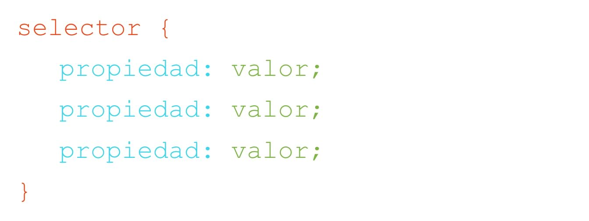

# Capítulo III - Introducción a CSS - Tipografías, Fondos y Selectores
<a name="top"></a>

### Tabla de contenido

+ [Introducción a CSS](#intro)
+ [Regla de Estilo](#regla)
+ [Métodos de vincular CSS](#vincular)
+ [Selectores de CSS](#selectors)
  + [de Etiquetas](#tags)
  + [de Clase](#class)
  + [de Id](#id)
+ [CSS - Tipografía](#typos)
  + [font-family](#ff)
  + [font-size](#fz)
  + [font-weight](#fw)
  + [font-style](#fs)
  + [text-align](#ta)
  + [text-decoration ](#td)
  + [text-transform](#tt)
  + [line-height](#lh)
  + [color](#color)
+ [CSS - Fondos](#bgs)
  + [background-color](#bgc)
  + [background-image](#bgi)
  + [background-repeat](#bgr)
  + [background-position](#bgp)
  + [background-attachment](#bga)
  + [opacity](#opa)
  + [rgba](#rgba)
+ [*Volver al índice principal*](https://github.com/japsolo/curso-intro-html-css/) 

---

<a name="intro"></a>
### Introducción a CSS

Ya que hemos llegado relativamente lejos, es el momento de incursionar en el mundo del CSS. Pero ¿qué es CSS?.

CSS, son las siglas que hacen referencia a **Cascading Style Sheet** o en castellano **Hoja de Estilo en Cascada**. Termino acuñado para definir el lenguaje que hace que el HTML sea visualmente *atractivo*. Pues como hemos visto hasta el momento, el propio lenguaje HTML carece de características visuales innatas, pues se concentra más en la generación de contenido.

CSS es muy importante, pues le da a nuestra estructura de contenido HTML una presentación estética y elegante. En la siguiente imagen podemos ver lo como se visualiza un sitio web CON y SIN CSS.


Como podes darte cuenta, CSS no solo da una estética visual si no que a su vez genera un orden visual de contenido para que cualquier visitante a nuestro sitio web pueda entender el mismo de una manera sencilla y clara.

Ahora bien, CSS, es un lenguaje que está compuesto por algo que llamamos **REGLA DE ESTILO**. La cual permite aplicar a un determinado elemento de HTML un **conjunto de propiedades** que alteran su presentación visual. Podríamos decir que HTML es el **Contenido** y CSS es la **Presentación** del mismo.

[ volver a la tabla de contenido](#top)

---

<a name="regla"></a>
### Regla de estilo

La regla de estilo es el *core*, el *nucleo* del lenguaje. La misma, no es otra cosa más que un conjunto de especificaciones que le asignamos a uno o varios elementos de nuestro HTML.

Una regla de estilo está compuesta inicialmente de 3 partes: **el selector**, **la propiedad** y el **valor de la propiedad**, veamos un ejemplo:


*Regla de estilo de CSS*

Definamos entonces cada una de sus partes:

- **selector**: es la parte de la regla de estilo que define a qué elemento del HTML se aplicará la regla.
- **propiedad**: es la característica visual que deseamos cambiar del elemento HTML.
- **valor**: es el valor en si de la propiedad que queremos cambiar.

Para no hacerlo tan abstracto, vemos un ejemplo más concreto:

```css
body {
  background-color: pink;
  font-family: Verdana;
  text-align: center;
}
```

En el ejemplo anterior el **selector** es `body`. Por lo tanto estamos definiendo que esta regla de estilo se aplicará a ese elemento HTML. Una propiedad es `background-color` y el valor a esta propiedad es `pink`. Tal como quizá lo estás imaginando, esta propiedad define que el color de fondo del `body` sea rosado. Algo importante: al conjunto de **propiedad** y **valor** se les conoce como **DECLARACIÓN**.

Como podés ver, la regla anterior tiene 3 **declaraciones**, lo que nos lleva al primer párrafo de éste apartado, cuando definíamos que es una regla de estilo. *...no es otra cosa más que un conjunto de especificaciones...*

Va tomando más sentido ¿no?

---

<a name="vincular"></a>
### Métodos de vincular CSS

Ahora que ya hemos entendido que es CSS y cómo está compuesto, podemos adentrarnos en las **3 formas** que existen para vincular nuestro CSS con nuestros documentos HTML.

+ [Vinculación Externa](#externa)
+ [Vinculación Interna](#interna)
+ [Vinculación En Línea](#enLinea)

<br>

#### Vinculación externa <a name="externa"></a>

Este método de vinculación es el más utilizado y se trata de crear una única **hoja de estilo** que guarde todas las reglas de CSS que vamos a aplicar a nuestro(s) documento(s) HTML.

Entendiendo que dicha hoja de estilo está dentro de nuestra estructura de archivos:

```
.
├── index.html          #archivo HTML
├── css                 #folder de css
│   └── main.css        #hoja de estilos CSS
└── ...
```

Para vincular la misma con nuestro(s) archivo(s) HTML ló único que tenemos que hacer es usar la etiqueta `<link>` que van dentro del `<head>` de nuestro documento HTML, así:

```html
<link href="css/main.css" rel="stylesheet">
```

Como lo vemos. La etiqueta `<link>` tiene 2 atributos `href=""` que tendrá como valor la ruta en donde se encuentra la hoja de estilos que queremos vincular y `rel=""` que siempre lleva el mismo valor `stylesheet`. Éste último define la **relación** existente entre el documento HTML y el CSS.

<br>

#### Vinculación Interna <a name="interna"></a>

Otra manera de asignar CSS a nuestro documento HTML, es a través de la **vinculación interna**, que no es otra cosa más que generar todas nuestras reglas de estilo DENTRO del mismo documento HTML a través de la etiqueta `<style>` la cual va dentro de las etiquetas `<head>` del documento. Veamos un ejemplo:

```html
<style>
  body {
    background-color: pink;
    font-family: Verdana;
    text-align: center;
  }
</style>
```

Quizás a esta altura te estés preguntando, ¿cual es la real diferencia entra la vinculación externa e interna? Pues bien, la diferencia puntual, es que si usas el método **externo**, la misma hoja de estilos te servirá para todos los documentos HTML que tengas, mientras que si usas el método **interno** tendrás que repetir el mismo código en cada documento HTML, lo que genera que el mantenimiendo y actualización del sitio sea algo complejo, pues si queres cambiar el color de fondo por otro, vas a tener que hacer el cambio en todos y cada uno de los archivos HTML donde hayas implementando el método interno, mientras que si tenés una hoja de estilo vinculada de manera externa, solo tendrás que cambiar dicha línea en el documento CSS y todos los archivos HTML que estén vinculados con esa hoja de estilo se verán actualizados de manera inmediata. Genial ¿no?.

<br>

#### Vinculación en línea <a name="enLinea"></a>

Esta técnica de vinculación se basa en aplicar declaraciones de CSS (**NO REGLAS**) a los elementos de HTML dentro de sus etiquetas de apertura a través del atributo `style=""`. Veamos como:

```html
<h1 style="text-align: center; font-family: Verdana">
```

Como te das cuenta, es dentro del mismo elemento HTML en donde escribimos el CSS. Sin embargo esta técnica es poco usada pues suele ser muy dificil de mantener y actualizar, ya que al igual que el método **interno** nos demandaría mucho tiempo, si tuvieramos un sitio web con muchos documentos HTML.

[ volver a la tabla de contenido](#top)

---

<a name="selectors"></a>
### Selectores de CSS

Tal como lo vimos en el apartado de **[Regla de Estilo](#regla)**, una de sus partes es el **SELECTOR**. Que es la parte de la regla de estilo que define a qué elemento del HTML vamos a aplicar la misma.

Como es lógico, no sería muy funcional tener un solo tipo de selector pues de ser así, nos veríamos muy limitados para aplicar los estilos que deseemos, por ello, CSS trae **3 tipos de selectores básicos** que nos permitirán tener un poco más de control al momento de aplicar nuestras reglas de estilo. Veamos cuales son.

<br>

<a name="tags"></a>
#### De Etiquetas

Este tipo de selector, toma el nombre de la etiqueta a la que deseamos aplicar estilo y a través de la misma, asigna la regla definida. Veamos un ejemplo:

```css
h1 {
  /* declaraciones CSS */
}

p {
  /* declaraciones CSS */
}

a {
  /* declaraciones CSS */
}
```

Si bien es un selector sencillo de aplicar (pues no tenemos que hacer nada más que definirlo en el CSS), nos genera una limitante y es que cualquier etiqueta de HTML que coincida con el selector, tomará la regla definida es decir, tomando el ejemplo anterior, todos los elementos `<h1>`, `<p>` y `<a>` del documento HTML aplicaran lo definido en la regla. Pero ¿qué pasa si queremos que un solo elemento de ellos se vea distinto?. Es ahí donde los otros dos selectores toman protagonismo.

[ volver a la tabla de contenido](#top)

<br>

<a name="class"></a>
#### De Clase

El selector de clase es algo diferente al de tipo etiqueta pues como primera medida inicia con un punto `.` seguido del nombre que deseemos dar al selector, veamos un ejemplo:

```css
.blue-text {
  color: blue;
}

.important-paragraph {
  background-color: red;
  color: white;
}
```

En el ejemplo anterior, somos nosotros quienes asignamos el nombre al selector tomando como referencia el objetivo del mismo. Y adentro de la regla, las cosas siguen como tradicionalmente lo hemos venido manejando: declaración tras declaración. Ahora bien, la duda que quizás nos surge es **¿cómo aplicamos este tipo de selector si nuestro HTML no tienn ningun elemento que se llame así?**. La respuesta, la podemos ver en el siguiente ejemplo:

```html
<p class="blue-text">Contenido de texto del párrafo</p>
<h2 class="blue-text">Contenido de texto del titular</h2>
```

Como vemos, para aplicar este regla de estilo tendremos que ir al elemento HTML que queremos que tome dicha regla e implementar en él el atributo `class=""` el cual recibe como valor el nombre del selector que creamos, sin la necesidad de escribir el punto `.`

De igual manera dicha regla puede ser aplicada a cualquier tipo de elemento HTML. Sencillo ¿no te parece?.

[ volver a la tabla de contenido](#top)

<br>

<a name="id"></a>
#### De Id

El selector de ID, es exactamente lo mismo que el selector de Clase, con una pequeña modificación, pues en vez de iniciar con un punto `.` iniciamos con un numeral `#` y luego le damos un nombre. Ejemplo:

```css
#header {
  /* declaraciones CSS */
}

#nav-bar {
  /* declaraciones CSS */
}

#main-content {
  /* declaraciones CSS */
}
```

Y al igual que el selector de Clase, para aplicar el selector de Id tendremos que ir al documento HTML y por medio de un atributo asignar la regla de estilo:

```html
<div id="header"></div>
<div id="nav-bar"></div>
<div id="main-content"></div>
```

Ahora bien, quizás en este momento te estés preguntando ¿entonces cuando debo usar un CLASS y cuando un ID?. La respuesta es sencilla, el selector de CLASE lo usás cuando sepas que dicha regla de estilo va a ser aplicada a **varios elementos** HTML, mientras que el selector de ID lo usás cuando sepas que esa regla se va a aplicar a **un solo elemento** del HTML.

Sin embargo, por buenas prácticas se recomienda que indistintamente de lo mencionado anteriormente, **uses siempre** selectores de clase y nunca selectores de id. [Puedes leer un poco más al respecto en éste articulo](https://css-tricks.com/the-difference-between-id-and-class/).

[ volver a la tabla de contenido](#top)

---

<a name="typos"></a>
### CSS - Tipografía

Ahora que hemos entendido a la perfección, qué son las reglas de estilo y como funcionan los selectores, ha llegado el momento de dar el salto a la *"pileta"* y sumergirnos en las diferentes propiedades que tiene CSS para dar estilo a los elementos. En este apartado hablaremos de las distintas propiedades que existen para estilizar características tipográficas.

<br>

<a name="ff"></a>
#### font-family

Esta propiedad es una propiedad de valor abierto y ¿qué significa esto?. Básicamente que el valor que recibe puede ser cualquiera que deseemos.

El `font-family` tal como su nombre lo indica, sirve para especificar la familia tipográfica que deseeamos asignar a un elemento de HTML. Esta propiedad puede recibir uno o varios valores separados por una coma `,` así:

```css
font-family: Verdana, Tahoma, sans-serif;
```

En el ejemplo anterior estamos especificando que como primer recurso se debe usar la tipografía **Verdana** y de no ser posible entonces usar **Tahoma** y como última opción **sans-serif**. En [este enlace](https://www.w3schools.com/cssref/css_websafe_fonts.asp) puedes encontrar todas las tipografías que puedes usar dentro de esta propiedad.

[ volver a la tabla de contenido](#top)

<br>

<a name="fz"></a>
#### font-size

La propiedad `font-size` nos sirve para implementar el tamaño que deseamos para la tipografía. Este valor puede ser expresado preferiblemente en `px` (pixeles) o `em` (em's). Veamos un ejemplo:

```css
font-size: 18px;
```

Al igual que con la propiedad `font-family`, ésta propiedad puede ser aplicada a cualquier elemento de HTML.

Si deseas conocer un poco más acerca de las [unidades de medida para tipografías](http://librosweb.es/referencia/css/medidas.html) puedes ingresar al enlace anterior y entender sus diferencias.

[ volver a la tabla de contenido](#top)

<br>

<a name="fw"></a>
#### font-weight

Esta propiedad sirve para definir el trazado de la tipografía, o en otras palabras para aplicar o eliminar la **negrilla** de un texto. El `font-weight` es una propiedad de *valor cerrado*, lo que significa que solamente puede recibir algunos de los valores establecidos. Éstos valores son:

+ `normal`
+ `bold`

Por defecto para la mayoría de elementos de HTML el valor de esta propiedad es `normal`, mientras que para algunos otros elementos su valor es `bold`, esto es facilmente identificable, pues todas aquellos elementos HTML que generen un texto en **negrilla** poseen esta propiedad con valor `bold`. Por ejemplo todos los `<h>`'s. Por lo tanto, si quisieramos cambiar el trazado a normal lo haríamos así:

```css
font-weight: normal;
```

Mientras que si quisieramos aplicar **negrilla** a algún elemento que no posee esta particularidad, por ejemplo a un párrafo (`<p>`), lo haríamos así:

```css
font-weight: bold;
```

[ volver a la tabla de contenido](#top)

<br>

<a name="fs"></a>
#### font-style

Así como tenemos la posibilidad de aplicar o eliminar el trazado **negrilla** de un texto, así mismo podemos aplicar un estilo **cursivo** o eliminar el mismo. Para ello sirve la propiedad `font-size`. La cual posee dos posibles valores:

+ `normal`
+ `cursive`

Por lo tanto, si desearamos implementar un estilo de tipografía cursiva a cualquier elemento de texto de HTML lo haríamos así:

```css
font-size: cursive;
```

Mientras que si quisieramos eliminar dicha característica, haríamos lo siguiente:

```css
font-size: normal;
```

[ volver a la tabla de contenido](#top)

<br>

<a name="ta"></a>
#### text-align

La propiedad `text-align` es otra propiedad CSS de valor cerrado, pues solo es posible aplicar uno de los siguientes valores:

+ `left`: alinea el bloque de texto a la izquierda **(viene por default)**.
+ `center`: alinea el bloque de texto a la derecha.
+ `right`: alinea el bloque de texto al centro.
+ `justify`: alinea el bloque de texto de manera justificada.

Se puede implementar en cualquier elemento de HTML así:

```css
text-align: center;
```

[ volver a la tabla de contenido](#top)

<br>

<a name="td"></a>
#### text-decoration

La propiedad `text-decoration` nor permite implementar una sencilla decoración a un elemento de texto HTML. Al ser una propiedad de valor cerrado, nos provee de las siguientes opciones:

+ `none`: no aplica ningún decorado **(default)**.
+ `underline`: aplica un subrayado al bloque de texto.
+ `overline`: aplica una línea sobre el bloque de texto.
+ `line-through`: aplica una línea que atraviesa (tacha) el bloque de texto.

Esta propiedad se puede implementar en cualquier elemento de texto HTML así:

```css
text-decoration: line-through;
```

[ volver a la tabla de contenido](#top)

<br>

<a name="tt"></a>
#### text-transform

La propiedad `text-transform` nos permite transformar un texto para poder mostrarlo en mayúsculas, minúsculas o una mezcla de estas dos, independientemente de como se implemente dicho texto en el HTML. Lo únicos valores posibles para esta propiedad son:

+ `none`: muestra el texto tal y como fue escrito en el HTML **(default)**.
+ `uppercase`: muestra todo el bloque de texto en mayúsculas.
+ `lowercase`: muestra todo el bloque de texto en  minúsculas.
+ `capitalize`: muestra la primera letra de cada palabra en mayúscula y el resto de letras en minúsculas.

Un ejemplo de su aplicación sería así:

```css
text-transform: uppercase;
```

[ volver a la tabla de contenido](#top)

<br>

<a name="lh"></a>
#### line-height

El `line-height` nos permite establecer el interlineado de un bloque de texto. Es una propiedad de valor abierto y recibe cualquier valor númerico expresado en `px` o `em`'s.

```css
line-height: 22px;
```

Esta propiedad va muy de la mano con el [`font-size`](#fz), pues por recomendación, el valor asignado en el `line-height` siempre debe tener `7px` a `9px` más que el valor definido en el `font-size`. Veamos:

```css
/* Ejemplo 1 */
font-size: 13px;
line-height: 20px;

/* Ejemplo 2 */
font-size: 18px;
line-height: 25px;
```

Debemos tener en cuenta que si el valor definido en `line-height` es inferior al definido en `font-size`, las líneas del bloque de texto estaran muy cerca la una de la otra, lo cual dificultará su legibilidad.

[ volver a la tabla de contenido](#top)

<br>

<a name="color"></a>
#### color

La propiedad `color` tal como su nombre lo indica sirve para aplicar cualquier color a la tipografía de un element HTML. Su uso es muy sencillo:

```css
color: green;
```

Esta propiedad va muy de la mano con los **formatos de color** permitidos en CSS, pues no solamente recibe valores relativos al nombre de un color, si no que también recibe formatos de color **hexadecimal** y **rgb**.

[ volver a la tabla de contenido](#top)

---

<a name="bgs"></a>
### CSS - Fondos

Así como CSS nos da un set de propiedades para poder manipular las tipografías, también nos provee de una serie de propiedades para implementar fondos (de color y de imagen) a los distintos elementos HTML. Éstas propiedades son:

<br>

<a name="bgc"></a>
#### background-color

El `background-color` nos da la posibilidad de implementar un color de fondo a cualquier elemento HTML, su aplicación sería así:

```css
background-color: red;
```

Como lo podemos ver es bastante sencillo ¿no te parece?. Pues lo único que necesitamos definir es el color que queremos implementar. Dicho color puede ser expresado de varias formas:

+  `colorKey`: palabra clave para referirse al color deseado. Ej: **blue**.
+ `#hex`: valor *hexadecimal* que referencia un color determinado. Ej: **#4762B0**.
+ `rgb`: valor *RGB* que define un color a implementar. Ej: **rgba(255, 0, 0)**.

Si deseas conocer un poco más acerca de los diversos formatos de color en CSS, [puedes visitar el siguiente recurso](http://librosweb.es/referencia/css/colores.html).

[ volver a la tabla de contenido](#top)

<br>

<a name="bgi"></a>
#### background-image

La propiedad `background-image` nos permite implementar una imagen de fondo a cualquier elemento HTML, ésta propiedad recibe como valor una `url` que hará referencia a la ubicación del archivo de imagen que deseamos aplicar como fondo. Veamos un ejemplo:

```css
background-image: url('../images/fondo-estrellas.png');
```

En el ejemplo anterior, estamos *invocando* la imagen llamada `fondo-estrellas.png` que se encuentra un nivel atrás (en referencia a nuestros documento `css`) dentro del folder `images`.

[ volver a la tabla de contenido](#top)

<br>

<a name="bgr"></a>
#### background-repeat

El `background-repeat` nos permite controlar el mecanismo de repetición de las imágenes de fondo. Esta es una propiedad de valor cerrado que solamente permite uno de los siguientes valores:

+ `repeat`: valor **default**. Hace que la imagen de fondo se repita tanto en el eje horizontal (`x`) como en el eje vertical (`y`).
+ `no-repeat`: evita que la imagen se repita en los dos `x` e `y`. Al no repetirse, la imagen de fondo queda ubicada en la esquina superior izquierda del elemento. Aunque esta posición se puede cambiar con la propiedad `background-position`.
+ `repeat-x`: permite que la imagen de fondo se repita únicamente en el eje horizontal (`x`).
+ `repeat-y`: permite que la imagen de fondo se repita únicamente en el eje vertical (`y`).

Esta propiedad solo surge efecto si existe una imagen de fondo asignada al elemento HTML. Veamos un ejemplo:

```css
background-image: url('../images/fondo-estrellas.png');
background-repeat: repeat-x;
```

El código anterior generará que la imagen de fondo, solamente se repita en el eje horizontal.

[ volver a la tabla de contenido](#top)

<br>

<a name="bgp"></a>
#### background-position

La propiedad `background-position` controla la posición de las imágenes de fondo. Si pensamos en cada elemento de HTML como un rectangulo, podemos decir que los mismos poseen cuatro costados (arriba, derecha, abajo izquierda) y éstos nos sirven para entender donde se posicionará una imagen de fondo.

Ésta propiedad recibe 2 valores separados entre si por un espacio. El 1er valor será asignado para el eje `x` y el 2do para el eje `y`.

Cada eje, tiene unos valores predeterminados. Los mismo son:

**EJE X**: `left`, `center` ó `right`.

**EJE Y**: `top`, `center` ó `bottom`.

Veamos un ejemplo:

```css
background-position: left center;
```

El código anterior, hará que la imagen de fondo se ubique horizontalmente al costado izquierdo y verticalmente a la mitad del elemento al cual aplicamos la imagen. Como es lógico, esta propiedad solo surge efecto si hay una imagen de fondo asignada. Ejemplo:

```css
background-image: url('../images/fondo-estrellas.png');
background-repeat: repeat-x;
background-position: left center;
```

[ volver a la tabla de contenido](#top)

<br>

<a name="bga"></a>
#### background-attachment

Esta propiedad nos permite controlar si la imagen de fondo se desplazar cuando hacemos scroll en el navegador o si por el contrario permanece fija sin desplazarse. Esta propiedad solamente posee dos valores posibles, los mismos son:

+ `scroll`: valor **default**, hace que la imagen de fondo se desplaze al mismo tiempo que hacemos scroll.
+ `fixed`: permite dejarla imagen de fondo fija y la misma no se desplazará si hacemos scroll.

Al igual que las otras propiedades para imágenes, el `background-attachment` solo tiene efecto si existe una imagen de fondo asignada.

```css
background-image: url('../images/fondo-estrellas.png');
background-attachment: fixed;
```

[ volver a la tabla de contenido](#top)

<br>

<a name="opa"></a>
#### opacity

La propiedad `opacity` no es en sí un mecanismo para aplicar fondos, si no que la misma permite asignar un determinado porcentaje de transparencia a cualquier elemento. Ésta propiedad recibe un valor númerico decimal que representa un `N%`. Veamos un ejemplo:

```css
opacity: 0.5;
```

El código anterior aplica una transparencia del `50%` al elemento HTML seleccionado. Si quisieramos por ejemplo un 30% aplicaríamos `0.3`, mientras que si quisieramos un 5% aplicaríamos `0.05`. A tener en cuenta: los valores que podemos aplicar en esta propiedad van del 0 al 1.

Algo importante a tener en cuenta es que si aplicamos esta propiedad a un elemento. Tanto él mismo como su contenido interno tendrán el mismo nivel de transparencia asignado.

[ volver a la tabla de contenido](#top)

<br>

<a name="rgba"></a>
#### rgba

**rgba** no es una propiedad implícita de CSS, si no que es una forma de aplicar un color. Pues hasta el momento hemos visto que si queremos aplicar con color (de fondo o tipografía) podíamos asignar el **nombre del color** o su valor **hexadecimal**. Sin embargo el **rgba** nos permite definir un color basado en los 3 canales básicos permitidos en pantalla:

+ `R`: para el canal Red.
+ `G`: para el canal Green;
+ `B`: para el canal Blue;

Cada uno de estos canales acepta un valor numérico entre 0 a 255. Sencillo ¿no?. Sin embargo hay una letra que nos quedó volando ¿viste cual es?. ¡Correcto! la **a**. 

La letra **a** hace referencia al CANAL ALPHA, el cual nos permite asignar una cantidad numérica expresada de manera decimal, muy parecido al valor asignado en la propiedad [opacity](#opa).

Veamos algunos ejemplos:

```css
background-color: rgba(255, 0, 0, 0.5); /* color de fondo ROJO con un 50% de transparencia */

color: rgba(0, 0, 255, 0.35); /* color tipográfico AZUL con un 65% de transparencia */
```

[ volver a la tabla de contenido](#top)

---

**Made with ❤️ by: [Javi Herrera](https://javier-herrera.com)**

*Si te parece interesante este tipo de contenido, puedes agradecerme con un Follow en mis siguientes redes sociales. Lo estimaría un montón.*

[](https://www.linkedin.com/in/japsolo/)
[](https://www.instagram.com/thefullstackdevs/)
[](https://open.spotify.com/show/3J2dLuBSfzt9VVnEF8q18a)