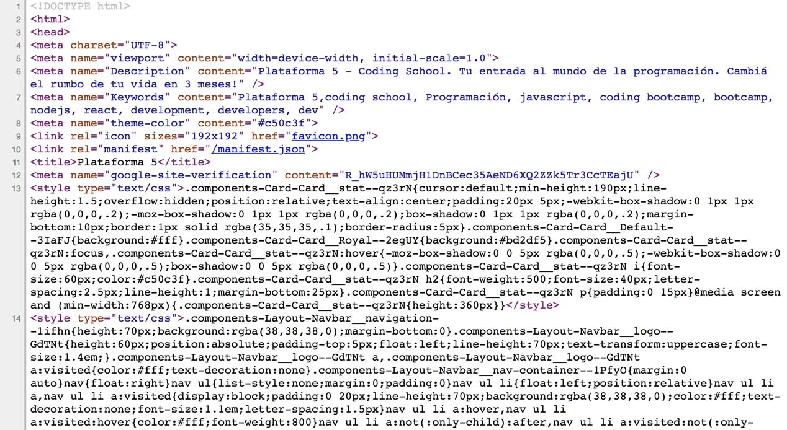
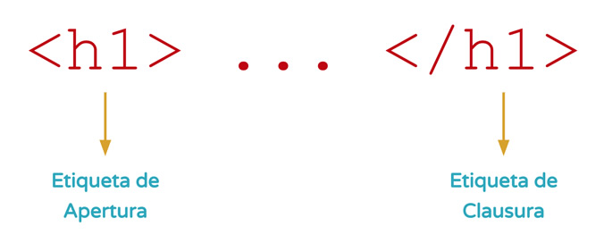
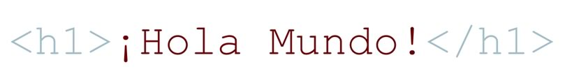

# Clase I - Introducción a HTML
<a name="top"></a>

### Tabla de contenido

+ [Qué es HTML](#html)
+ [Concepto de Etiqueta](#etiquetas)
+ [Concepto de Elemento](#elemento)
+ [Estructura básica de un documento HTML](#estructura)
+ [Concepto de atributo](#atributos)
+ [Etiquetas](#etiquetas)
	+ [Encabezados](#headers)
	+ [Párrafos](#p)
	+ [Salto de línea](#br)
	+ [Listas ordenadas](#ol)
	+ [Listas desordenadas](#ul)
+ [URL's](#urls)
	+ [Relativas](#relativas)
	+ [Absolutas](#absolutas)
+ [Enlaces](#anchors)
	+ [Externos](#externos)
	+ [Internos](#internos)
	+ [Locales](#locales)
	+ [De otro tipo](#otros)
+ [Imágenes](#imagenes)

---

<a name="html"></a>
### Qué es HTML

Lo primero que necesitamos saber es que HTML **no es un lenguaje de programación**. Lo que quizás nos deja con una enorme duda de: **Y entonces ¿qué es HTML?**. Bien, para responder a esta pregunta, podemos decir que HTML es un lenguaje de marcado de hipertexto (en inglés _Hyper Text Markup Language_).

Básicamente, HTML este lenguaje que está compuesto de **etiquetas**, las cuales a su vez conforman **elementos** y poseen **contenido y atributos**.

_Wooow_ ¡Vamos más lento por favor!. Antes de pasar a estos conceptos "técnicos". Entendamos un poco de donde viene este lenguaje.

Es importante que sepamos que la primer versión de HTML fue publicada en 1991 por [Tim Berners-Lee](https://es.wikipedia.org/wiki/Tim_Berners-Lee), un científico británico. En principio esta versión contenía muy pocas etiquetas.

Sobre Tim, debemos saber también que es conocido como el padre de la web, fundador de la W3C - [World Wide Web Consortium](http://w3c.org), creador del protocolo **HTTP** (_HyperText Transfer Protocol_), creador de la **URL** (_Uniform Resource Locator_) y creador del primer navegador web. ¿Sorprendente no? Por eso **amamos** a Tim.

Ahora bien, pasando un poco más a lo técnico. HTML es un lenguaje que es interpretado por el navegador para mostrar los sitios web tal y como estamos acostumbrados. En la siguiente imagen podemos ver un sitio web como generalmente estamos habituados.


Pero _"tras bambalinas"_ lo que realmente está sucediendo es esto:


_Vos por tu cuenta podés ver este código también en cualquier sitio web, basta con que pulsés el click derecho del mouse y elijás la opción **ver codigo fuente**_

Como te das cuenta, lo visual, está compuesto por código HTML, por etiquetas (elementos), contenido y atributos. En algunas palabras podríamos decir que el HTML es el ADN de cualquier sitio web.

Más claro ahora ¿no?. Ahora si, con esta pequeña introducción, estamos listos para adentrarnos en los conceptos más técnicos y entender **¿qué son las etiquetas?**.

[ volver a la tabla de contenido](#top)

---

<a name="etiquetas"></a>
### Concepto de etiqueta

Una vez habiendo entendido de primera mano qué es HTML, ahora podemos adentrarnos en uno de sus conceptos más clave: **las etiquetas**.

Podríamos decir que una etiqueta, es un bloque de código que representa algo de manera visual. Por ejemplo, si quisieramos generar un título principal en nuestro archivo HTML. Tendríamos que usar la etiqueta para títulos principales, mientras que si queremos mostrar una imagen, tendremos que usar la etiqueta para invocar imágenes.

Cómo podemos darnos cuenta, **cada etiqueta cumple con una función particular**. Cada etiqueta es responsable de algo específico.

Lógicamente, como en cualquier lenguaje, existe una manera correcta de escribir las cosas, HTML no es la excepción, pues tiene en si, una forma correcta de escribir las etiquetas, a esto lo llamamos **sintaxis**. Veamos de manera gráfica como es la **sintaxis** de una etiqueta HTML.



Como podemos ver, **una etiqueta está compuesta por dos partes**, _la etiqueta de apertura_ y la _etiqueta de clausura_. Las cuales tienen algo en particular y es el uso de los símbolos `<` y `>`. Así mismo las dos partes, dentro de los símbolos `<` y `>` llevan el nombre de la etiqueta que deseamos usar. Adicionalmente la _etiqueta de clausura_ lleva el símbolo `\` antes del nombre de la etiqueta. Un ejemplo de varias etiquetas sería:

```html
<h1>Título principal</h1>
<h2>Título secundario</h2>
<p>Un párrafo o bloque de texto.</p>
```

¿Sencillo verdad? Cómo te das cuenta no es tan complicado como parece. Ahora que ya entendemos que es una etiqueta. Podemos seguir avanzando y aprender qué es un **elemento de HTML**.

[ volver a la tabla de contenido](#top)

---

<a name="elemento"></a>
### Concepto de elemento

El concepto de elemento es el más sencillo de todos. Pues basta con ver la siguiente imagen para entenderlo en su totalidad.



Cómo podemos ver, **un elemento** no es otra cosa más que **una etiqueta y su contenido interno**. Obviamente, las etiquetas podrían tener a su vez **atributos**, pero ese es un concepto que ahondaremos más adelante.


<!-- Mini proyecto: hacer una página simple y subirla a Bitballoon -->

<!-- [subir](#top) -->
